# vue_shop 
Vue-cli3搭建Vue后台管理
前端技术栈采用Vue+VueRouter+Element-UI+Axios+Echarts，后端技术栈采用Node.js+Express+Jwt(模拟session)+Mysql+Sequelize组成
## Project setup
```
npm install
```

### Compiles and hot-reloads for development
```
npm run serve
```

### Compiles and minifies for production
```
npm run build
```

### Lints and fixes files
```
npm run lint
```

### Customize configuration
See [Configuration Reference](https://cli.vuejs.org/config/).
## 技术要点
- [x] `vue`
- [x] `vue-router`
- [x] `axios`
- [x] `ElementUI`
- [x] `Echarts`

## vue-router技术要点
```
使用vue-router
    1. 创建路由器: router/index.js
      new VueRouter({
        routes: [
          { // 一般路由
            path: '/about',
            component: about
          },
          { // 自动跳转路由
            path: '/', 
            redirect: '/about'
          }
        ]
      })
    2. 注册路由器: main.js
       import router from './router'
       	new Vue({
       		router
       	})
    3. 使用路由组件标签:
       	<router-link to="/xxx">Go to XXX</router-link>
       	<router-view></router-view>
编写路由的3步
    1. 定义路由组件    
    2. 映射路由
    3. 编写路由2个标签
嵌套路由
    children: [
        {
          path: '/home/news',
          component: news
        },
        {
          path: 'message',
          component: message
        }
     ]
向路由组件传递数据
    params: <router-link to="/home/news/abc/123">
    props: <router-view msg='abc'>
缓存路由组件
    <keep-alive>
      <router-view></router-view>
    </keep-alive>
路由的编程式导航
	this.$router.push(path): 相当于点击路由链接(可以返回到当前路由界面)
	this.$router.replace(path): 用新路由替换当前路由(不可以返回到当前路由界面)
	this.$router.back(): 请求(返回)上一个记录路由
 ```
## 功能
- [x] 登录/退出功能
- [x] 用户管理模块
- [x] 权限管理模块
- [x] 分类管理模块
- [x] 参数管理模块
- [x] 商品管理模块
- [x] 订单管理模块
- [x] 数据统计模块

## 项目截图
###登录
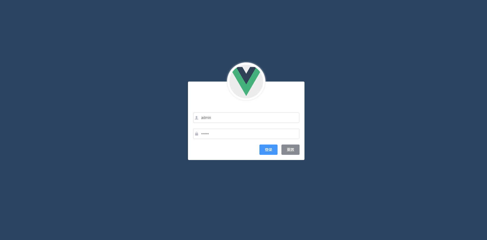
### 用户管理-用户列表
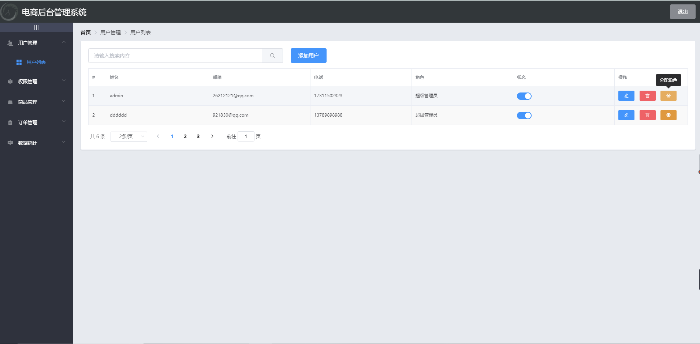
### 权限管理-角色列表
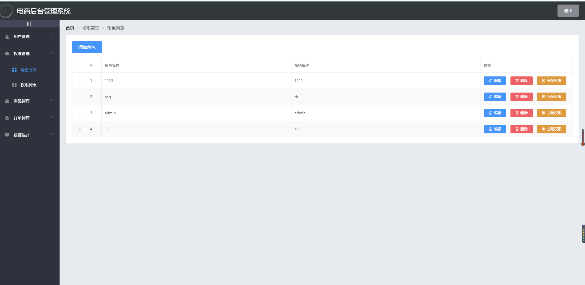
### 权限管理-角色列表（分配权限）
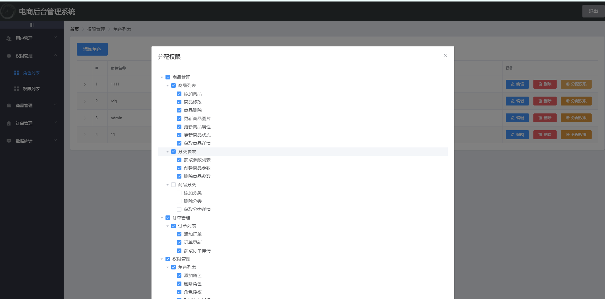
### 权限管理-权限列表
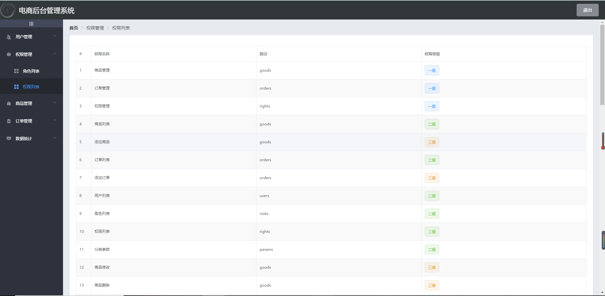
### 商品管理-商品列表
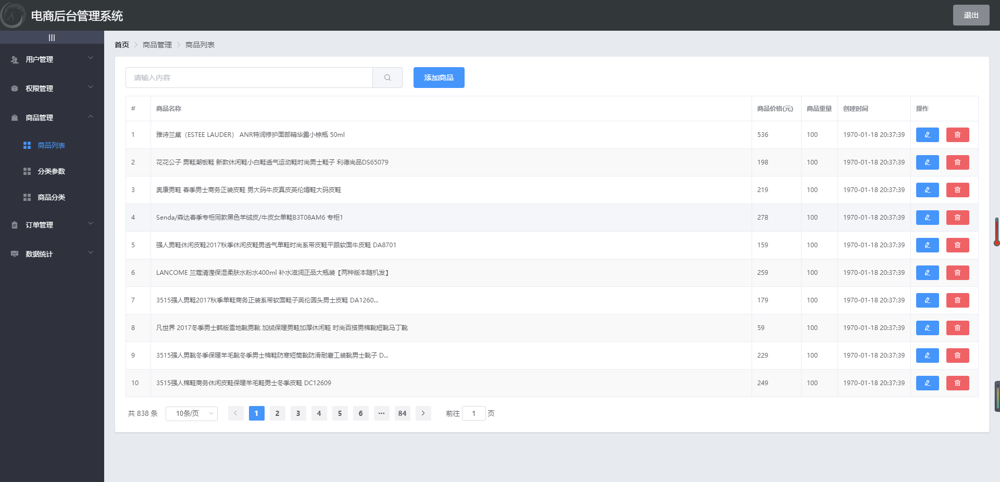
### 商品管理-商品列表（添加）
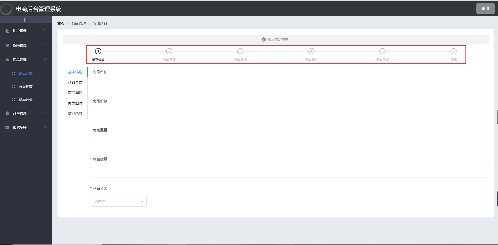
### 商品管理-分类参数
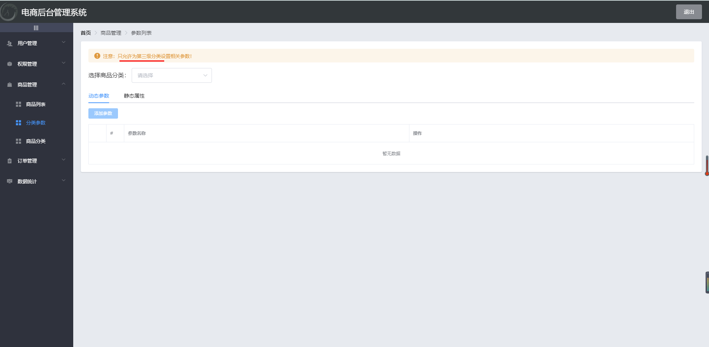

### 商品管理-商品分类
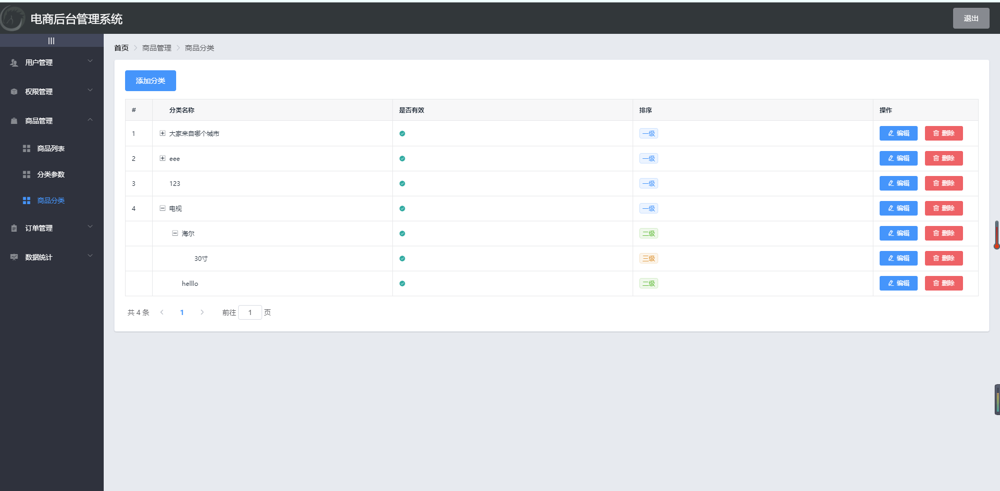
### 订单管理-订单列表
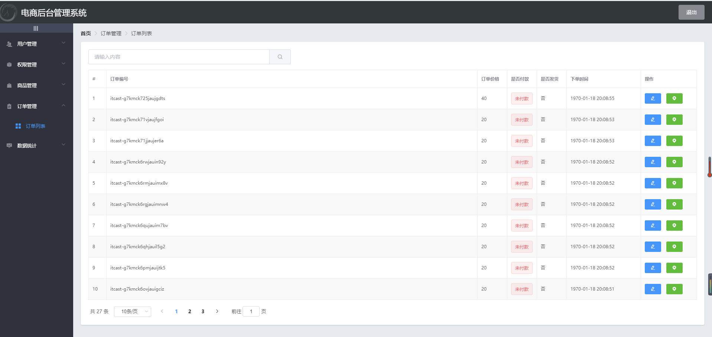
### 订单管理-订单列表(物流信息)
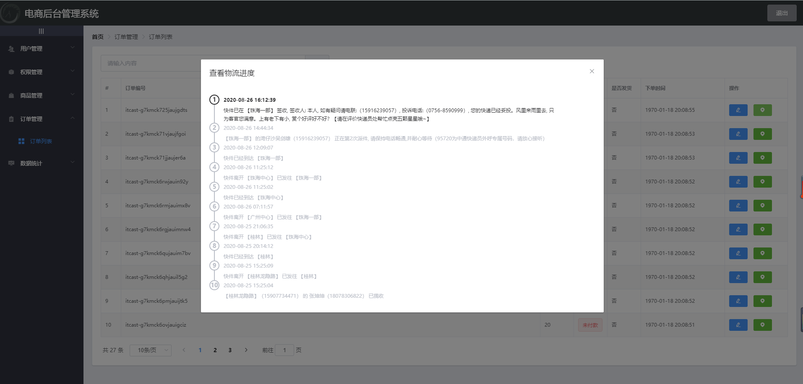
### 订单管理-订单列表(修改订单地址)

### 数据统计-数据报表（添加）
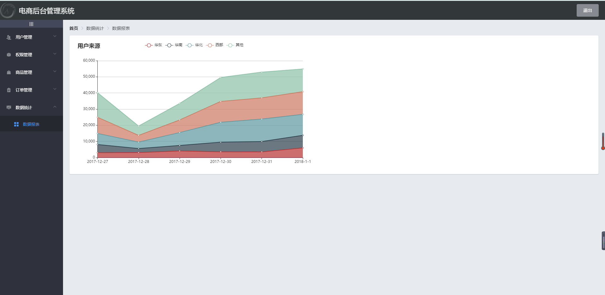
